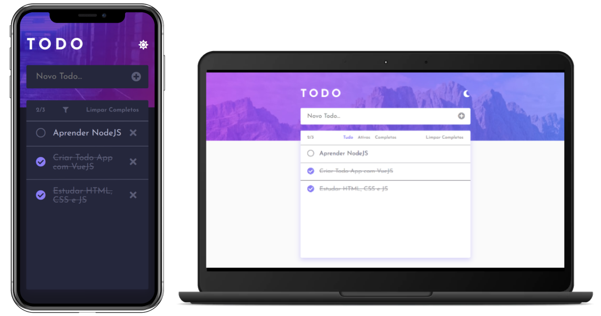

# Todo App
Projeto criado com base no desafio ["Todo app"](https://www.frontendmentor.io/challenges/todo-app-Su1_KokOW) do FrontendMentor para praticar os conhecimentos em [VueJS](https://vuejs.org).

**Teste a aplicação clicando [aqui](https://vuejs-tasks.vercel.app).**

## Design


## Pré-requisitos
Antes de começar, você precisará das seguintes ferramentas instaladas em sua máquina:
- [NodeJS](https://nodejs.org/en)
- [Git](https://git-scm.com/)

## Instruções de Instalação
Com as ferramentas devidamente instaladas, execute os seguintes comandos:
```
# Clone o repositório
git clone https://github.com/filipealvess/todo-app.git

# Entre na pasta do projeto
cd todo-app

# Instale as dependências
npm install

# Execute a aplicação em modo de desenvolvimento
npm run serve
```
